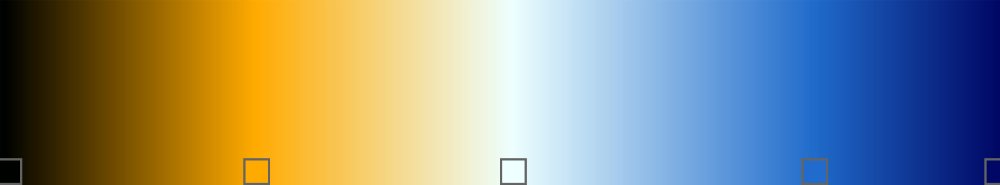
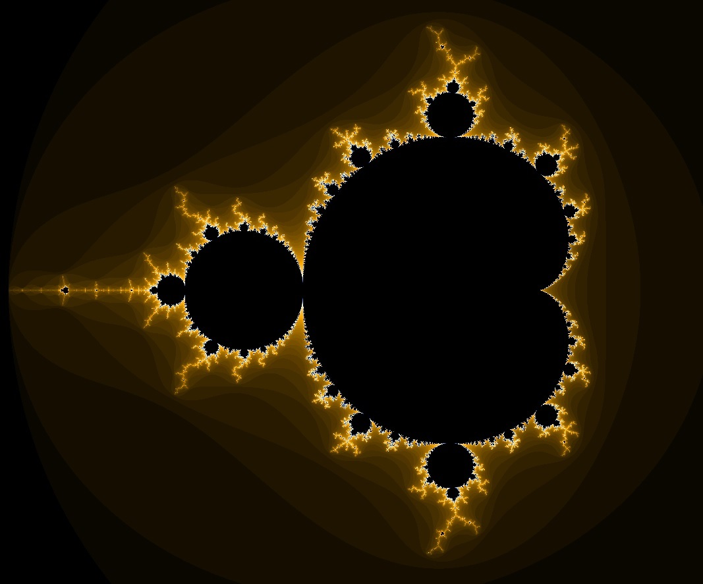
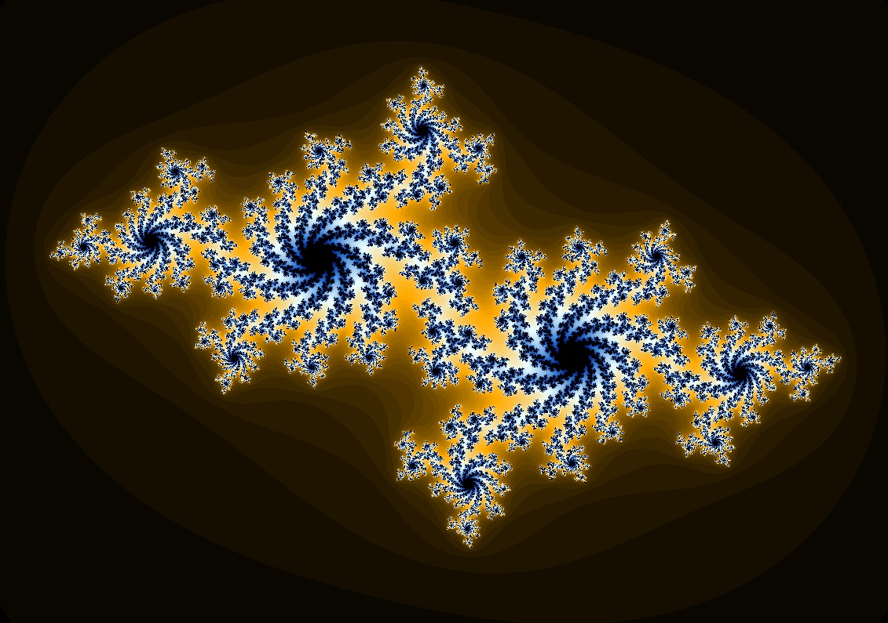
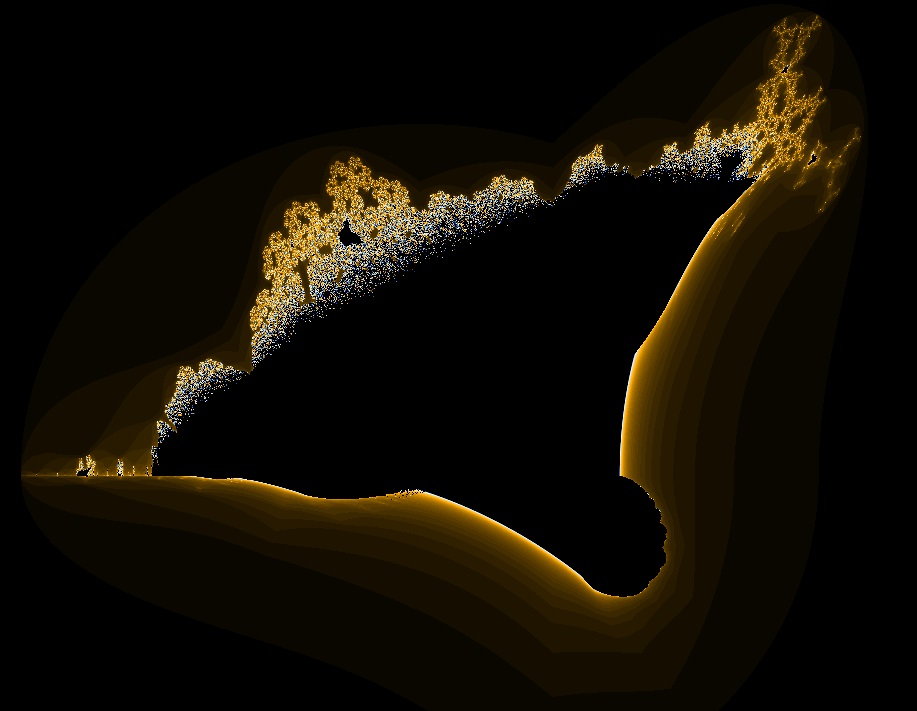
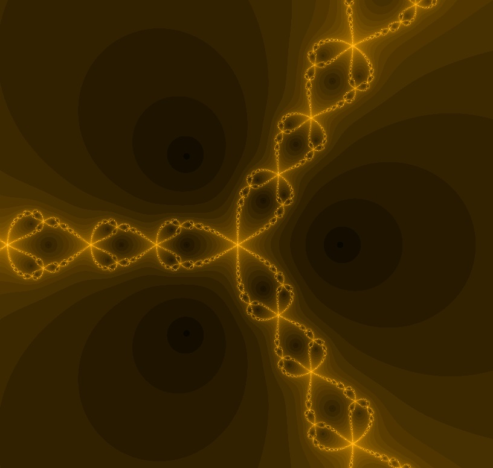

# Fractals    
I made a project for fractals a few years ago, and since lots of time passed I decided to recreate this using new technologies and languages (the last version was written with C++ using SFML library) to make them more portable. 

Now you can browse what I've done using Github pages: 
<a href="https://armemius.github.io/fractals/" style="text-decoration: none; color: #34a853">armemius.github.io/fractals</a>

## Fractals
* Mandelbrot set
* Julia set (C = [-0.67, -0.36])
* Flaming ship
* Newton fractal (Roots: [1.0, 0.0], [-0.5, 0.866], [-0.5, -0.866])

## Settings
### Visual
* Grid - applies grid to the viewport, which reduces the number of calculations for fractal each frame, improves speed by quality
* Noise - same as a grid, but pixels to skip are chosen randomly
### Render modes
* None - pretty self-explanatory, just doesn't render at all
* Frame - renders whole frame of fractal (can be really slow)
* Random pixels - updates random pixels on a frame (default)
* Random rows - updates random rows of pixels on a frame
* Random columns - updates random columns of pixels on a frame

<b>In future it might be possible to select the device to render on (CPU/GPU)</b>

## Gradient
For colouring, I used inversed ultra fractal gradient, how it looks like you can see below:

## Screenshots

